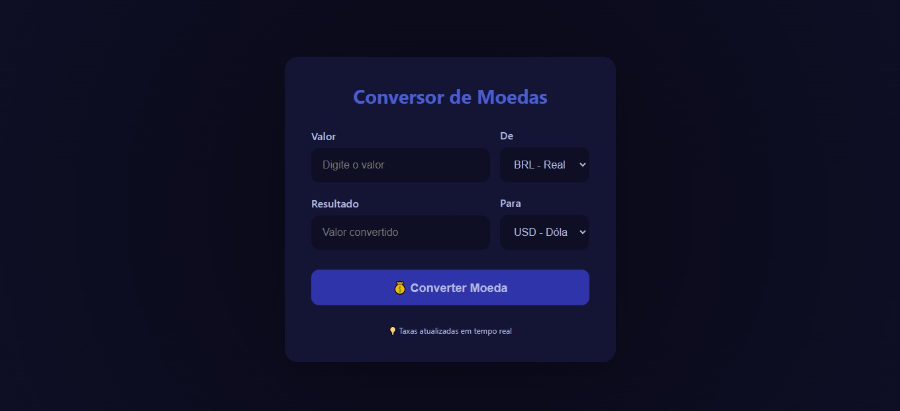

# 💱 Conversor de Moedas

Projeto Front-End de um conversor de moedas, desenvolvido para praticar consumo de API, manipulação do DOM e exibição dinâmica de dados em tempo real.

## 🖥️ Demonstração
🔗 Site online: https://conversor-moedas-eight-fawn.vercel.app/  
🔗 Repositório: https://github.com/mellacer/Conversor-Moedas

## 📸 Preview


## 🛠️ Tecnologias Utilizadas
- HTML5
- CSS3
- JavaScript

## ⚙️ Funcionalidades
- Conversão de valores entre diferentes moedas
- Consumo de API externa para taxas de câmbio atualizadas
- Exibição dinâmica do valor convertido
- Indicação visual de carregamento durante a requisição
- Tratamento de erros em caso de falha na conversão

## 📚 Objetivo do Projeto
Projeto desenvolvido com fins educacionais, com o objetivo de praticar:
- Consumo de APIs com `fetch`
- Manipulação do DOM com JavaScript
- Uso de funções assíncronas (`async/await`)
- Tratamento de erros
- Integração entre HTML, CSS e JavaScript

## 🚀 Como executar o projeto
```bash
# Clone o repositório
git clone https://github.com/mellacer/Conversor-Moedas

# Acesse a pasta do projeto
cd Conversor-Moedas

# Abra o arquivo index.html no navegador
